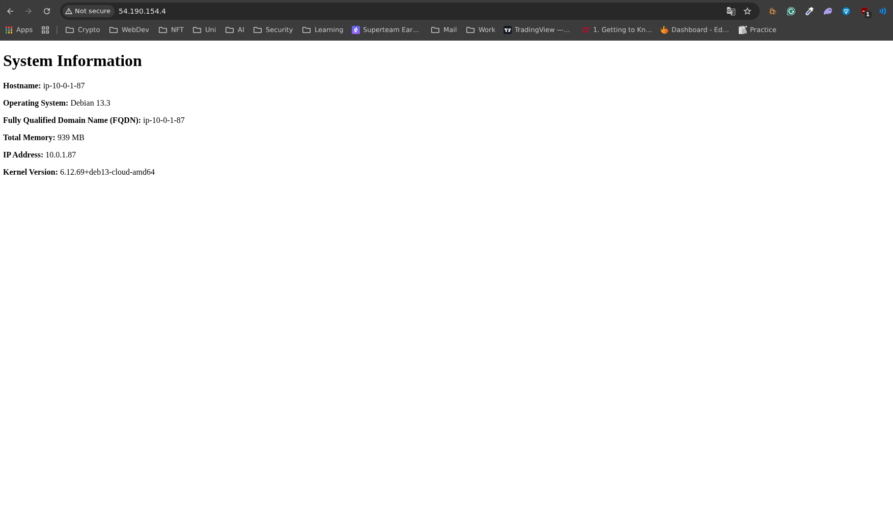

# acit4640-wk7-intro-to-ansible-lab-files

Maksym Buhai
Augustin Nguyen
Jasmeen Sandhu

### Installing Ansible

1. Install Ansible
    
    ```bash
    sudo apt update
    sudo apt install ansible
    ```

### Create SSH Key & Build Infrastructure

1. Create a SSH key: `aws`
    
    ```bash
    ssh-keygen -t ed25519 -f ~/.ssh/aws
    ```
    
2. Add the public key to your AWS account by running the `import_lab_key` script
    
    ```bash
    sudo chmod +x import_lab_key
    ./import_lab_key ~/.ssh/aws.pub
    ```
    
3. Check AWS to ensure the key was successfully imported
    
4. Run the terraform configurations. Note the IP and DNS outputted
    
    ```bash
    # initalize terraform
    terraform init
    
    # format and validate
    terraform fmt
    terraform validate
    
    # plan to ensure eveything looks good
    terraform plan
    
    # apply the terraform file
    terraform apply
    ```
### Configure Ansible Playbook

Edit the `playbook.yml` file 

1. Configure the play book to run against every host with root privileges
    
    ```bash
    - name: Configure web servers
      hosts: all 
      become: yes
    ```
    
2. Install Nginx on both servers with the package module
    
    ```bash
        - name: Install nginx
          ansible.builtin.package:
            name: nginx # Package to install
            state: present # Ensure it's installed
            update_cache: yes
    ```
    
3. Create directory for index.html file using the file module
    
    ```bash
        - name: create directory structure for web documents
          ansible.builtin.file:
            path: /web/html # Folder where index.html will be located
            state: directory # Make sure it's a directory
            recurse: yes # Apply permissions recursively
    ```
    
4. Copy the nginx.conf file to your servers with the copy module
    
    ```bash
        - name: copy nginx conf file to server
          ansible.builtin.copy:
            src: files/nginx.conf # source path
            dest: /etc/nginx/sites-available/default # destination path 
    ```
    
5. Make a link with the file module to /etc/nginx/sites-enabled/default
    
    ```bash
        - name: create link to nginx config file to enable it
          ansible.builtin.file:
            src: /etc/nginx/sites-available/default # Existing config file
            dest: /etc/nginx/sites-enabled/default # Symlink that "enables" the site
            state: link # Make it a symbolic link
    ```
    
6. Create an index.html file from the index.html.j2 template using the template module
    
    ```bash
        - name: Generate index.html file from template
          ansible.builtin.template:
            src: templates/index.html.j2 # Jinja2 template file
            dest: /web/html/index.html # HTML file to generate
    ```
    
7. Reload the nginx service with the service module
    
    ```bash
        - name: reload nginx service
          ansible.builtin.service:
            name: nginx # nginx service
            state: reloaded # reload config
            enabled: yes # Start nginx on boot
    ```
    
8. Validate the playbook
    
    ```bash
    ansible-playbook --syntax-check playbook.yml
    ```
    
9. Run the playbook
    
    ```bash
    ansible-playbook playbook.yml
    ```
    

### Cleanup

1. Destroy terraform infrastructure
    
    ```bash
    terraform destroy 
    ```
2. Remove the SSH key with the  **`delete_lab_key`** script
    
    ```bash
    sudo chmod +x delete_lab_key
    ./delete_lab_key
    ```

### Results




